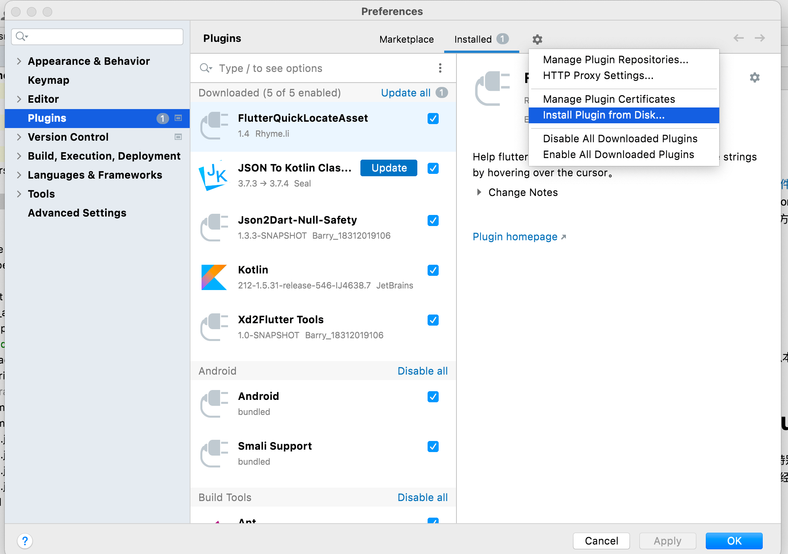
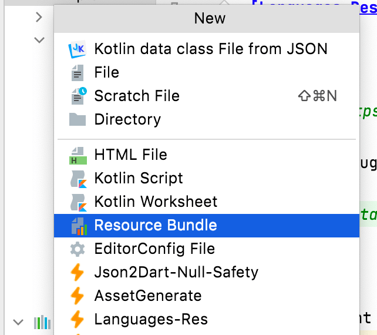
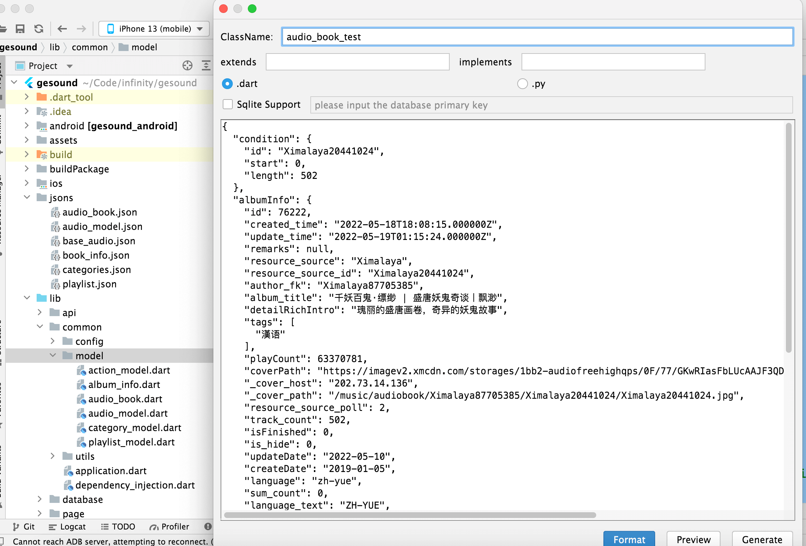
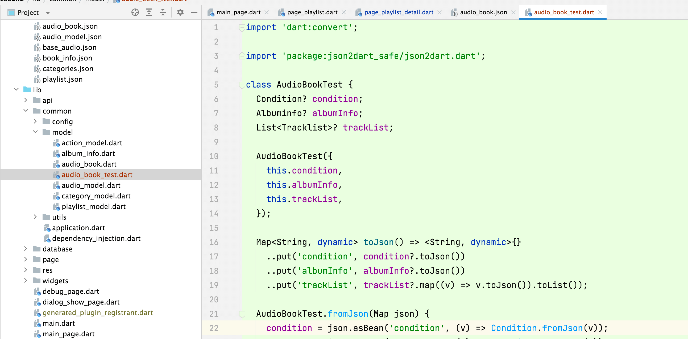
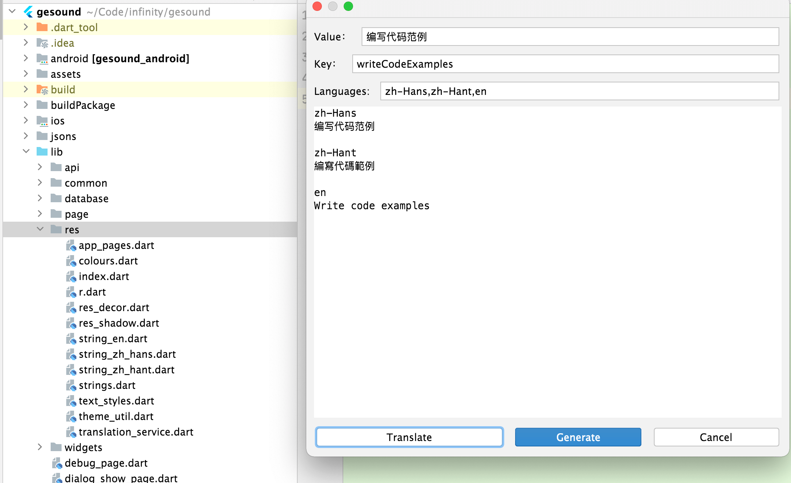
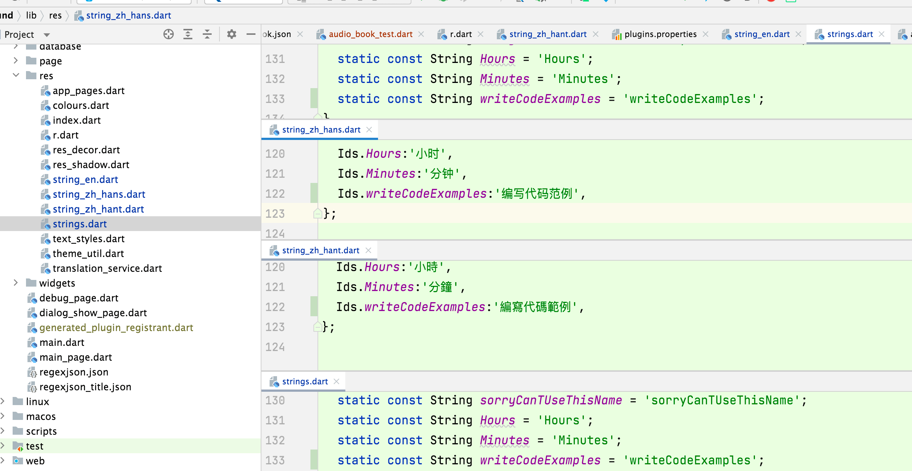
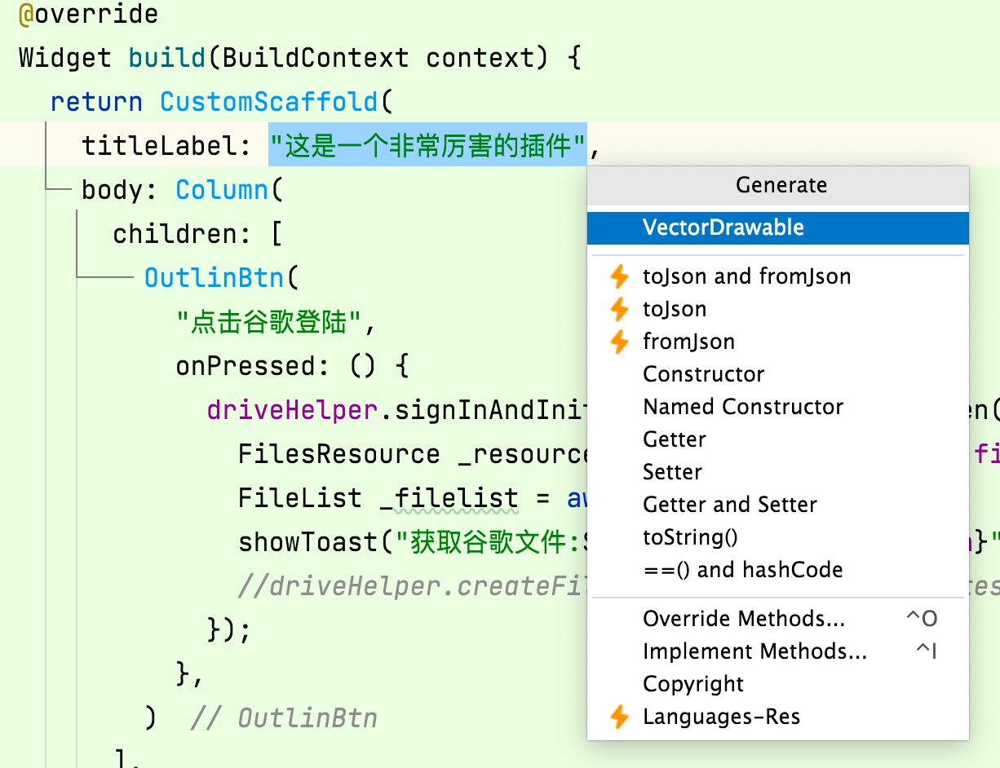
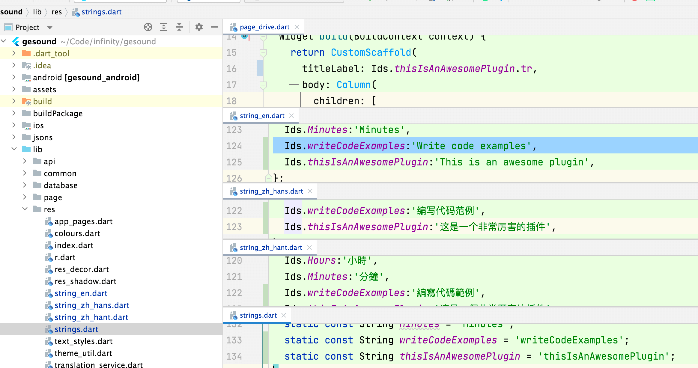

# 插件介绍

- <font color=blue>Json2Dart-Null-Safety:</font>用于生成json转dart的模型
    - <font color=blue>fromJson: </font> 生成fromJson的方法
    - <font color=blue>toJson: </font> 生成toJson的方法
- <font color=blue>AssetGenerate:</font>用于生成资源文件的索引
- <font color=blue>Languages-Res:</font>用于生成翻译资源

# 插件安装

请点击[下载](https://github.com/fastcode555/JsonBeanGenerator/tree/master/publish_version) 最新的版本，并从本地进行安装：
</br></br>
Prefercens->Plugin->Setting->Install Plugin from Disk
</br>


# 使用方法

Macos 使用 <font color=red>Command+N</font>键，就能看到如下弹窗： 选中想要的插件就可以对其进行使用了


# Json2Dart-Null-Safety

基于之前json转dart模型不是特别方便，而且常见的几种也数据类型安全，经过几个版本的迭代，已经成熟的应用于各个项目中，因此特意写下来记录一下，供各位参考。</br>
</br>
选取一段[json](pic/datas/audio_book.json)数据,选中自己模型将要生成的文件夹，这里进行简单示例，如下：

- ClassName 写上文件名，真正的className会自动生成
- extends 模型需要继承的类名
- implements 模型需要实现的类名
  

接着按下generate就可以看到生成的 [数据模型](pic/datas/audio_book_test.dart):


## 生成常用的几个方法如下：

- fromJson

```dart
  ///这里直接就是Map,不特意指名类型能兼容更多的库
  AudioBookTest.fromJson(Map json) {
    condition = json.asBean('condition', (v) => Condition.fromJson(v));
    albumInfo = json.asBean('albumInfo', (v) => Albuminfo.fromJson(v));
    trackList = json.asList<Tracklist>('trackList', (v) => Tracklist.fromJson(v));
  }
```

- toJson

```dart
  ///增加了..put的扩展方法，如果是null，字段就不会被放进去，为空字符串也不会
  Map<String, dynamic> toJson() => <String, dynamic>{}
    ..put('condition', condition?.toJson())
    ..put('albumInfo', albumInfo?.toJson())
    ..put('trackList', trackList?.map((v) => v.toJson()).toList());
```

- toBean </br>

```dart
  ///第一个父类增加了一个静态方法，方便方法引用
  static AudioBookTest toBean(Map json) => AudioBookTest.fromJson(json);
```

- toString </br>

```dart
  ///复写toString方法，将数据又重新以json形式导出
  String toString() => jsonEncode(toJson());
```

<font color=red>生成的模型依赖 [json2dart_safe](https://pub.dev/packages/json2dart_safe/versions) 的依赖库</font>
，注意如果不需要使用数据库，就直接选取没有database结尾的，虽然说flutter的编译的时候会省略掉无用的代码，各位视情况而定。

## fromJson toJson 插件

为已有的模型类添加toJson跟fromJson的方法，有时候会编写一个类，不是通过json的，这时再想通过json转又需要去生成一个json数据，直接从已有的类中进行模型的生成。

# AssetGenerate
之前项目中都是通过字符串对文件资源资源直接进行引用，导致后面跟进这个图片是否使用到比较麻烦，或是否已经存在而不会出现许多一样的资源，故可以通过插件生成一个R.资源文件，此如果是安卓过来的同学，就能知道是什么意思，使用简单，直接贴上示例代码：
```dart
class R {
  ///------------------------ assets ------------------------
  static const String icShift = 'assets/ic_shift.svg';
  static const String icGoogle = 'assets/ic_google.png';

  ///------------------------ auth ------------------------
  static const String icGoogleLogin = 'assets/auth/ic_google_login.png';
  static const String icFacebookLogin = 'assets/auth/ic_facebook_login.png';

  ///------------------------ data ------------------------
  static const String areacode = 'assets/data/areaCode.json';

  ///------------------------ common ------------------------
  static const String icLauncher = 'assets/common/ic_launcher.png';
  static const String icDefaultUser = 'assets/common/ic_default_user.svg';
  static const String iconSuperMusic = 'assets/common/icon_super_music.png';
  static const String iconFeatherWifi = 'assets/common/icon_feather_wifi.png';

  ///------------------------ bottombar ------------------------
  static const String icTabSearchActive = 'assets/bottombar/ic_tab_search_active.svg';
  static const String icTabSearchNormal = 'assets/bottombar/ic_tab_search_normal.svg';
  ///------------------------ assets_rate ------------------------
  static const String icStar = 'assets/assets_rate/ic_star.svg';
  static const String icStarFill = 'assets/assets_rate/ic_star_fill.svg';
  static const String icStarHalf = 'assets/assets_rate/ic_star_half.svg';

  ///------------------------ assets_animations ------------------------
  static const String launchAnmiation1 = 'assets/assets_animations/launch_anmiation_1.png';
 }

```
# Language-Res
语言的翻译插件，需要在根目录加一个插件配置用于指定需要生成的语言，配置内容如下：
```properties
plugin.languages=zh-Hans,zh-Hant,en
plugin.needTranslate=true
plugin.countryCode=CN,HK,US
plugin.languageDir=/lib/res
```
- <font color=red>这里是根据getx 搭建的项目进行生成的</font>
- <font color=red>调用google免费的api，次数过多可能会被限制，导致无法生成</font>

## 1.直接选中res目录，生成翻译
- 选中res文件夹，按下COMMAND+N，选中Language-Res
- 在value中输入需要进行多语言的文字
- 点击Translate，会show出结果，并生成对应的key值（可手动修改key值）
- 点击Generate，生成翻译代码


可以看到四个文件都有状态变化，
- string.dart 生成字段引用的Ids
- string_en,string_zh_hans,string_zh_hant则分别生成了对应语言的翻译


## 2.选中文本，进行翻译
在已经编写在代码中的文本进行抽取，选中文字，COMMAND+N选中Language-Res，选中的文字,如下图所示：

其它的一致，也是点击translate，然后generate，就能得到如下翻译结果
